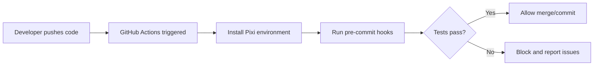

# Testing Setup for Pipeline Benchmarking

This directory contains automated tests to ensure the quality and consistency of the pipeline benchmarking project.

**📖 For comprehensive validation framework documentation, see [`docs/DATA_VALIDATION.md`](../docs/DATA_VALIDATION.md)**

## :clipboard: Overview

The testing infrastructure includes:

1. **SeqKit Subsampling Specification Consistency Tests** - Ensures that
SeqKit subsampling specification files maintain their expected structure
and content
2. **Pre-commit Hooks** - Automatic checks that run before each commit
3. **CI/CD Pipeline** - GitHub Actions workflow for continuous integration

## :zap: Pre-commit Hooks and Code Quality

This project uses comprehensive pre-commit hooks to ensure code quality
and consistency:

### R-Specific Hooks (lorenzwalthert/precommit)

- **style-files**: Automatic R code formatting using styler with tidyverse style
- **parsable-R**: Ensures R code is syntactically correct
- **lintr**: R code linting with project-specific rules
(see `.lintr` configuration)
- **no-browser-statement**: Prevents `browser()` statements in production code
- **no-debug-statement**: Prevents `debug()` statements in production code
- **spell-check**: Intelligent spell checking with comprehensive exclusions
for technical terms

### General File Quality Hooks

- **trailing-whitespace**: Removes trailing whitespace
- **end-of-file-fixer**: Ensures files end with newline
- **check-toml**: Validates TOML file syntax
- **check-yaml**: Validates YAML file syntax
- **check-added-large-files**: Prevents committing files larger than 1MB
- **check-merge-conflict**: Prevents committing files with merge conflict markers
- **check-case-conflict**: Prevents case-only filename conflicts

### Local Custom Hooks

- **test-seqkit-consistency**:
Runs SeqKit subsampling specification consistency tests
when relevant files are modified

### :dart: Design Philosophy

**:zap: Pre-commit hooks are intentionally kept fast**
to encourage frequent commits and maintain developer productivity.

**:test_tube: Comprehensive tests**
(including SeqKit subsampling specification consistency tests)
are run only in the CI/CD pipeline to avoid blocking the development workflow.

### Configuration

The pre-commit configuration is in `.pre-commit-config.yaml` and includes:

- **Exclusions**: Properly configured to exclude test data, generated files,
and technical documents
- **Hook Order**: Optimized execution order for efficiency
- **Fail Fast**: Disabled to show all issues at once

## :test_tube: Test Files

### `test_seqkit_subsampling_specs.R`

This is the main test file that verifies the consistency
of SeqKit subsampling specification files generated
by the synthetic dataset generation script.

**What it tests:**

- **File Existence**:
Ensures all expected SeqKit subsampling specification files exist
- **File Structure**:
Validates the format of each subsampling specification line
- **Read Count Consistency**: Verifies that read counts match expected values
- **Diversity Level Distribution**:
Checks that diversity levels (low, mid, high) are correctly distributed
- **Paired Read Consistency**: Ensures paired reads are properly matched
- **Seed Format Validation**: Ensures seeds are valid integers
(but doesn't test specific values)
- **Deterministic Output**:
Ensures the generation script produces consistent results

**Expected Files:**
- `data/synthetic/generation/syn_specs/seqkit_subsampling_specs_1e+04.txt`
(10,000 reads)
- `data/synthetic/generation/syn_specs/seqkit_subsampling_specs_1e+05.txt`
(100,000 reads)
- `data/synthetic/generation/syn_specs/seqkit_subsampling_specs_1e+06.txt`
(1,000,000 reads)
- `data/synthetic/generation/syn_specs/seqkit_subsampling_specs_1e+07.txt`
(10,000,000 reads)

### `test_syn_dataset_validation.R`

This test file validates synthetic dataset integrity, format, and content
with intelligent caching for performance optimization.
It validates both individual organism-specific FASTQ GZipped files
and aggregated synthetic datasets.

**What it tests:**

- **File Integrity**: Validates file existence, size, and gzip integrity
- **FASTQ Format Compliance**:
Ensures files follow proper FASTQ format structure
- **Paired-end Consistency**:
Verifies forward and reverse reads are properly matched
- **Read Count Accuracy**:
Validates that aggregated files contain exactly the expected number of reads
- **Dataset Structure**: Checks filename patterns and metadata consistency

**Key Features:**

- **:zap: Intelligent Caching**:
Stores validation results in `syn_dataset_validation_cache.json` for performance
- **:computer: Parallel Processing**:
Uses `mclapply` for efficient validation of large datasets
- **:mag: Comprehensive Validation**:
Tests both individual organism files and aggregated simulation files
- **:warning: Graceful Handling**:
Skips tests when datasets are not available with clear error messages

**Expected Directory Structure:**
```
data/synthetic/datasets/
├── low_diversity/
│   ├── individual/     # Organism-specific FASTQ files
│   └── aggregated/     # Simulation-aggregated FASTQ files
├── mid_diversity/
│   ├── individual/
│   └── aggregated/
├── high_diversity/
│   ├── individual/
│   └── aggregated/
└── cache/
    └── syn_dataset_validation_cache.json  # Cached validation results
```

**Performance:**
- **First run**: ~3.5 minutes (validates all files)
- **Without caching**: ~37 minutes (10x slower)
- **Subsequent runs**: ~1m (uses cached results)
- **Cache invalidation**: Automatic based on file modification times

## :rocket: Running Tests

### Manual Testing

```bash
# Run all SeqKit subsampling specification consistency tests
Rscript tests/test_seqkit_subsampling_specs.R

# Run synthetic dataset validation tests (requires generated datasets)
Rscript tests/test_syn_dataset_validation.R
```

### Pre-commit Hooks

The pre-commit hooks will automatically run tests when you commit changes:

```bash
# Install pre-commit hooks (one-time setup)
pre-commit install

# Run pre-commit hooks manually
pre-commit run --all-files

# Run specific hook
pre-commit run test-seqkit-subsampling-specs
```

### :arrows_clockwise: CI/CD Pipeline

Tests are automatically run on every push to main and pull request
via GitHub Actions.
The workflow includes:

1. **Environment Setup** - Uses Pixi for consistent dependency management
2. **Pre-commit Validation** - Runs all pre-commit hooks on the entire codebase
3. **:test_tube: Comprehensive Testing** -
Runs SeqKit subsampling specification consistency tests
and other comprehensive validations
4. **:dna: Dataset Validation** -
Synthetic dataset validation tests are run locally/HPC due to DVC dependencies
5. **Cross-platform Testing** -
Runs on Ubuntu to catch environment-specific issues
6. **Quality Gates** -
Enforces code formatting, syntax, and custom test requirements

## Test Configuration

### Expected Values

The tests expect the following configuration:

- **Read Counts**: 10,000, 100,000, 1,000,000, 10,000,000
- **Diversity Levels**: low, mid, high
- **Simulations per Level**: 5 simulations per diversity level
- **Total Subsampling Specifications**:
120 specifications per file
(4 read depths × 3 levels × 5 simulations × 2 paired reads)

### File Format

Each line in the SeqKit subsampling specification files
should follow this format:

```
INPUT_FILE SEED READ_COUNT OUTPUT_FILE
```

Example:
```
ERR10785402_1.fastq.gz 134 144 mid/ERR10785402_mid_1_10000_1.fastq.gz
```

**Note on Seeds**: The specific seed values (like `134` in the example)
are not tested for consistency because they depend on
the number of random number generator calls in the code.
Any refactoring that changes the order or number of `sample()` calls
will produce different seed values, even if the overall logic remains correct.

## Adding New Tests

To add new tests:

1. Create a new test file in the `tests/` directory
2. Follow the naming convention: `test_*.R`
3. Use the `testthat` framework
4. Add the test to the pre-commit configuration if needed
5. Update this README with test documentation

### Example Test Structure

```r
#!/usr/bin/env Rscript
library(testthat)

context("My New Test Suite")

test_that("My test description", {
  # Test implementation
  expect_true(TRUE)
})
```

## :wrench: Troubleshooting

### Common Issues

1. **Missing Dependencies**
   ```bash
   pixi add r-testthat r-tidyverse r-lintr r-styler
   ```

2. **Pre-commit Hook Failures**
   ```bash
   # Update pre-commit hooks
   pre-commit autoupdate

   # Reinstall hooks
   pre-commit install
   ```

3. **R Version Issues**
   - Ensure you're using R 4.4 or later
   - Check that all required packages are installed via Pixi

### Debug Mode

To run tests in debug mode:

```bash
# Enable debug output
Rscript -e "options(testthat.output_file = stdout())" tests/test_seqkit_subsampling_specs.R
```

## :handshake: Contributing

When contributing to the project:

1. **Write Tests**: Add tests for new functionality
2. **Update Tests**: Modify existing tests when changing behavior
3. **Run Tests**: Always run tests before submitting changes
4. **Document**: Update this README when adding new tests

## CI/CD Integration

The GitHub Actions workflow (`.github/workflows/ci.yaml`) automatically:

- Runs on every push to `main` branch
- Runs on every pull request targeting `main`
- Installs dependencies via Pixi
- Executes all tests
- Reports results
- Uploads artifacts on failure

### CI/CD Pipeline Details

This project uses GitHub Actions for automated testing and quality assurance.
The CI pipeline provides:

#### Trigger Conditions
- Runs on every push to the `main` branch
- Runs on every pull request targeting `main`
- Ensures quality before code reaches the main branch

#### Environment Consistency
- Uses the same Pixi environment as local development
- Ensures dependencies are identical across all environments
- Prevents "works on my machine" issues

#### Quality Validation
- Runs all pre-commit hooks on the entire codebase
- Validates R code formatting and syntax
- Checks for code quality issues (browser/debug statements)
- Performs spell checking with R-specific exclusions
- **🧪 Executes comprehensive tests** including SeqKit command consistency tests
- **📋 Excludes dataset validation**
(requires DVC-tracked files, run locally/HPC)

#### Pull Request Protection
- Prevents merging code that fails quality checks
- Ensures all contributors follow the same standards
- Maintains code quality across the entire project

#### Benefits
- **Reliability**: Catches issues before they reach production
- **Consistency**: All code follows the same quality standards
- **Collaboration**: Multiple contributors can work confidently
- **Maintenance**: Automated quality checks reduce manual review burden
- **Reproducibility**: Ensures the pipeline works in clean environments

#### Workflow Diagram



## :zap: Performance Considerations

- Tests are designed to run quickly (< 30 seconds)
- Large files are not loaded entirely into memory
- Tests use efficient data structures and algorithms
- CI/CD pipeline uses caching to speed up builds

## :lock: Security

- Tests do not execute any external commands
- No sensitive data is processed
- All file operations are read-only
- Input validation prevents code injection
