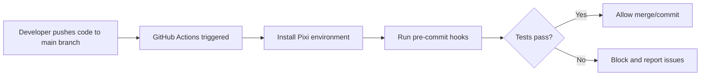

# Testing Setup for Synthetic Metatranscriptome Generator

This directory contains automated tests to ensure the quality
  and consistency of the synthetic metatranscriptome generator.

**:memo: For comprehensive validation framework documentation, see [`DATA_VALIDATION.md`](DATA_VALIDATION.md)**

## :bookmark_tabs: Table of Contents

- [:mag: Overview](#overview)
- [:zap: Pre-commit Hooks and Code Quality](#pre-commit-hooks-and-code-quality)
  - [:robot: R-Specific Hooks](#r-specific-hooks)
  - [:file_folder: General File Quality Hooks](#general-file-quality-hooks)
  - [:house: Local Custom Hooks](#local-custom-hooks)
  - [:bulb: Design Philosophy](#design-philosophy)
  - [:gear: Configuration](#configuration)
- [:test_tube: Test Files](#test-files)
- [:rocket: Running Tests](#running-tests)
  - [:computer: Manual Testing](#manual-testing)
  - [:zap: Pre-commit Hooks](#pre-commit-hooks)
  - [:building_construction: CI Pipeline](#ci-pipeline)
- [:clipboard: Test Configuration](#test-configuration)
- [:heavy_plus_sign: Adding New Tests](#adding-new-tests)
- [:wrench: Troubleshooting](#troubleshooting)
  - [:warning: Common Issues](#common-issues)
  - [:bug: Debug Mode](#debug-mode)
- [:zap: Performance Considerations](#performance-considerations)
- [:lock: Security](#security)
- [:handshake: Contributing](#contributing)

<div id="overview"></div>

## :mag: Overview

The testing infrastructure includes:

1. **SeqKit Subsampling Specification Consistency Tests**:
  Ensures that SeqKit subsampling specification files
    maintain their expected structure and content
2. **Pre-commit Hooks**:
  Automatic checks that run before each commit
3. **CI/CD Pipeline**:
  GitHub Actions workflow for continuous integration

<div id="pre-commit-hooks-and-code-quality"></div>

## :zap: Pre-commit Hooks and Code Quality

This project uses comprehensive pre-commit hooks to ensure code quality
  and consistency:

<div id="r-specific-hooks"></div>

### :robot: R-Specific Hooks

- **style-files**:
  Automatic R code formatting using styler with tidyverse style
- **parsable-R**:
  Ensures R code is syntactically correct
- **lintr**:
  R code linting with project-specific rules (see `.lintr` configuration)
- **no-browser-statement**:
  Prevents `browser()` statements in production code
- **no-debug-statement**:
  Prevents `debug()` statements in production code
- **spell-check**:
  Intelligent spell checking with comprehensive exclusions for technical terms

<div id="general-file-quality-hooks"></div>

### :file_folder: General File Quality Hooks

- **trailing-whitespace**:
  Removes trailing whitespace
- **end-of-file-fixer**:
  Ensures files end with newline
- **check-toml**:
  Validates TOML file syntax
- **check-yaml**:
  Validates YAML file syntax
- **check-added-large-files**:
  Prevents committing files larger than 1MB
- **check-merge-conflict**:
  Prevents committing files with merge conflict markers
- **check-case-conflict**:
  Prevents case-only filename conflicts

<div id="local-custom-hooks"></div>

### :house: Local Custom Hooks

- **test-seqkit-consistency**:
Runs SeqKit subsampling specification consistency tests
  when relevant files are modified

<div id="design-philosophy"></div>

### :bulb: Design Philosophy

**:zap: Pre-commit hooks are intentionally kept fast**
  to encourage frequent commits and maintain developer productivity.

**:test_tube: Comprehensive tests**
  including SeqKit subsampling specification consistency tests
  are run only in the CI/CD pipeline to avoid blocking the development workflow.

<div id="configuration"></div>

### :gear: Configuration

The pre-commit configuration is in `.pre-commit-config.yaml` and includes:

- **Exclusions**:
  Properly configured to exclude test data, generated files,
    and technical documents
- **Hook Order**:
  Optimized execution order for efficiency
- **Fail Fast**:
  Disabled to show all issues at once

<div id="test-files"></div>

## :test_tube: Test Files

### `test_seqkit_subsampling_specs.R`

This is the main test file that verifies the consistency
  of SeqKit subsampling specification files generated
  by the synthetic dataset generation script.

**What it tests:**

- **File Existence**:
  Ensures all expected SeqKit subsampling specification files exist
- **File Structure**:
  Validates the format of each subsampling specification line
- **Read Count Consistency**:
  Verifies that read counts match expected values
- **Diversity Level Distribution**:
  Checks that diversity levels (low, mid, high) are correctly distributed
- **Paired Read Consistency**:
  Ensures paired reads are properly matched
- **Seed Format Validation**:
  Ensures seeds are valid integers (but doesn't test specific values)
- **Deterministic Output**:
  Ensures the generation script produces consistent results

**Expected Files:**
- `data/syn_specs/seqkit_subsampling_specs_1e+04.txt` (10,000 reads)
- `data/syn_specs/seqkit_subsampling_specs_1e+05.txt` (100,000 reads)
- `data/syn_specs/seqkit_subsampling_specs_1e+06.txt` (1,000,000 reads)
- `data/syn_specs/seqkit_subsampling_specs_1e+07.txt` (10,000,000 reads)

### `test_syn_dataset_validation.R`

This test file validates synthetic dataset integrity, format,
  and content with intelligent caching for performance optimization.
It validates both individual organism-specific FASTQ GZipped files
  and aggregated synthetic datasets.

**What it tests:**

- **File Integrity**:
  Validates file existence, size, and gzip integrity
- **FASTQ Format Compliance**:
  Ensures files follow proper FASTQ format structure
- **Paired-end Consistency**:
  Verifies forward and reverse reads are properly matched
- **Read Count Accuracy**:
  Validates that aggregated files contain exactly the expected number of reads
- **Dataset Structure**:
  Checks filename patterns and metadata consistency

**Key Features:**

- **:zap: Intelligent Caching**:
  Stores validation results in `syn_dataset_validation_cache.json` for performance
- **:computer: Parallel Processing**:
  Uses `mclapply` for efficient validation of large datasets
- **:mag: Comprehensive Validation**:
  Tests both individual organism files and aggregated simulation files
- **:warning: Graceful Handling**:
  Skips tests when datasets are not available with clear error messages

**Expected Directory Structure:**
```
data/datasets/
├── low_diversity/
│   ├── individual/                         # Organism-specific FASTQ files
│   └── aggregated/                         # Simulation-aggregated FASTQ files
├── mid_diversity/
│   ├── individual/
│   └── aggregated/
├── high_diversity/
│   ├── individual/
│   └── aggregated/
└── cache/
    └── syn_dataset_validation_cache.json   # Cached validation results
```

**Performance:**
- **First run**: ~3.5 minutes (creates cache)
- **Normal operation**: ~1 minute (uses validated cached results)
- **Partial cache updates**:
~1-3 minutes (updates cache with new and modified files)
- **Complete cache regeneration**: ~3.5 minutes (when needed)
- **Without caching**: ~37 minutes (10x slower)

<div id="running-tests"></div>

## :rocket: Running Tests

<div id="manual-testing"></div>

### :construction_worker: Manual Testing

```bash
# Run all SeqKit subsampling specification consistency tests
Rscript tests/test_seqkit_subsampling_specs.R

# Run synthetic dataset validation tests (requires generated datasets)
Rscript tests/test_syn_dataset_validation.R
```

<div id="pre-commit-hooks"></div>

### :zap: Pre-commit Hooks

The pre-commit hooks will automatically run tests when you commit changes:

> Hooks rely on the Pixi-managed R environment. Always invoke them through
> Pixi so they reuse `.pixi/envs/default` and skip redundant renv restores.

```bash
# Install pre-commit hooks (one-time setup inside Pixi)
pixi run pre-commit install

# Run pre-commit hooks manually
pixi run pre-commit run --all-files

# Run a specific hook
pixi run pre-commit run test-seqkit-subsampling-specs
```

<div id="ci-pipeline"></div>

## :building_construction: CI Pipeline

This project uses GitHub Actions for automated testing and quality assurance.
The GitHub Actions workflow (`.github/workflows/ci.yaml`) automatically:

- Runs on every push to `main` branch
- Runs on every pull request targeting `main`
- Installs dependencies via Pixi
- Executes all tests
- Reports results
- Uploads artifacts on failure

Therefore, the CI pipeline ensures quality before code reaches the main branch.

### Workflow Overview:



<div id="environment-consistency"></div>

### Environment Consistency

- Uses the same Pixi environment as local development
- Ensures dependencies are identical across all environments
- Prevents "works on my machine" issues

### Quality Validation
- Runs all pre-commit hooks on the entire codebase
- Validates R code formatting and syntax
- Checks for code quality issues (browser/debug statements)
- Performs spell checking with R-specific exclusions
- Executes comprehensive tests including SeqKit command consistency tests
- Excludes dataset validation (requires generated files, run locally/HPC)

### Pull Request Protection
- Prevents merging code that fails quality checks
- Ensures all contributors follow the same standards
- Maintains code quality across the entire project

### Benefits
- **Reliability**: Catches issues before they reach production
- **Consistency**: All code follows the same quality standards
- **Collaboration**: Multiple contributors can work confidently
- **Maintenance**: Automated quality checks reduce manual review burden
- **Reproducibility**: Ensures the pipeline works in clean environments

<div id="test-configuration"></div>

## :clipboard: Test Configuration

The tests expect the following configuration:

- **Read Counts**:
  10,000, 100,000, 1,000,000, 10,000,000
- **Diversity Levels**:
  low, mid, high
- **Simulations per Level**:
  5 simulations per diversity level
- **Total Subsampling Specifications**:
  120 specifications per file
    (4 read depths × 3 levels × 5 simulations × 2 paired reads)

### :memo: File Format

Each line in the SeqKit subsampling specification files
  should follow this format:

```
INPUT_FILE SEED READ_COUNT OUTPUT_FILE
```

Example:
```
ERR10785402_1.fastq.gz 134 144 mid/ERR10785402_mid_1_10000_1.fastq.gz
```

:information_source: **Note on Seeds**:
  The specific seed values (like `134` in the example)
    are not tested for consistency because they depend on
    the number of random number generator calls in the code.
  Any refactoring that changes the order or number of `sample()` calls
    will produce different seed values, even if the overall logic remains correct.

<div id="adding-new-tests"></div>

## :heavy_plus_sign: Adding New Tests

To add new tests:

1. Create a new test file in the `tests/` directory
2. Follow the naming convention: `test_*.R`
3. Use the `testthat` framework
4. Add the test to the pre-commit configuration if needed
5. Update this README with test documentation

### :memo: Example Test Structure

```r
#!/usr/bin/env Rscript
library(testthat)

context("My New Test Suite")

test_that("My test description", {
  # Test implementation
  expect_true(TRUE)
})
```

<div id="troubleshooting"></div>

## :wrench: Troubleshooting

### :warning: Common Issues

- **Missing Dependencies**
   ```bash
   pixi add r-testthat r-tidyverse r-lintr r-styler
   ```

- **Pre-commit Hook Failures**
   ```bash
   # Update pre-commit hooks
   pre-commit autoupdate

   # Reinstall hooks
   pre-commit install
   ```

- **R Version Issues**
   - Ensure you're using R 4.4 or later
   - Check that all required packages are installed via Pixi

### :bug: Debug Mode

To run tests in debug mode:

```bash
# Enable debug output
Rscript -e "options(testthat.output_file = stdout())" tests/test_seqkit_subsampling_specs.R
```


<div id="performance-considerations"></div>

## :zap: Performance Considerations

- Tests are designed to run quickly (< 30 seconds)
- Large files are not loaded entirely into memory
- Tests use efficient data structures and algorithms
- CI/CD pipeline uses caching to speed up builds

<div id="security"></div>

## :lock: Security

- Tests do not execute any external commands
- No sensitive data is processed
- All file operations are read-only
- Input validation prevents code injection

<div id="contributing"></div>

## :handshake: Contributing

When contributing to the project:

1. **Write Tests**: Add tests for new functionality
2. **Update Tests**: Modify existing tests when changing behavior
3. **Run Tests**: Always run tests before submitting changes
4. **Document**: Update this README when adding new tests
